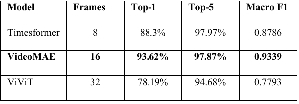
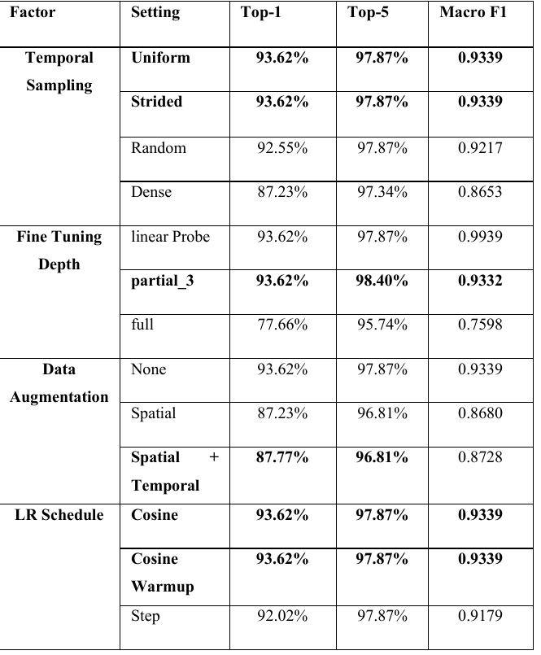
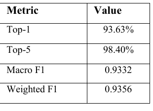
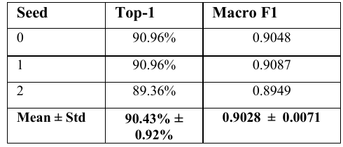
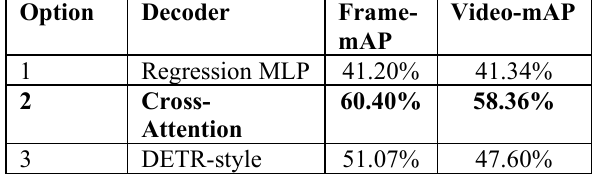
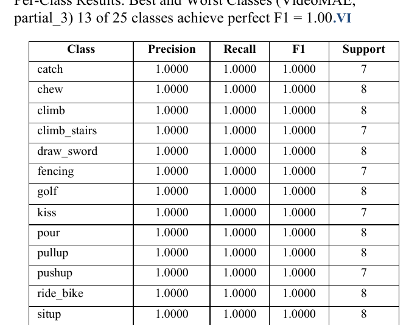
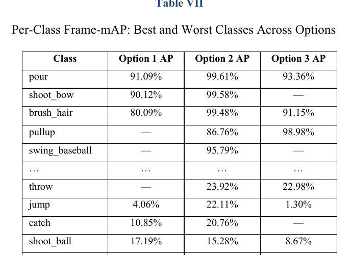
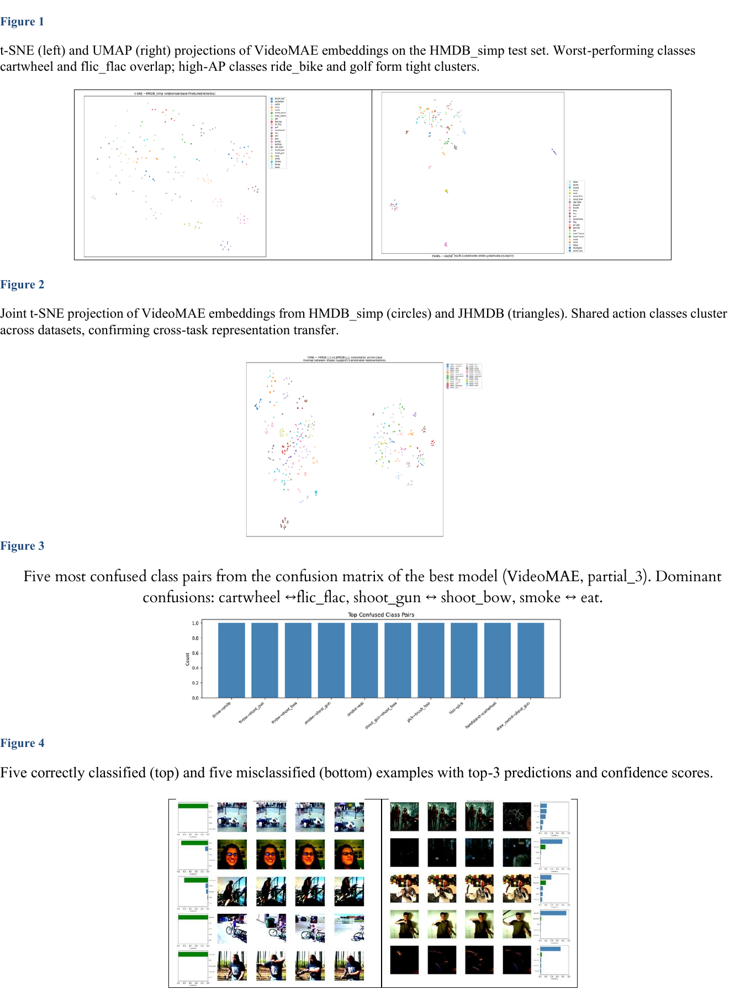

# Action Recognition using Vision Transformers

## Overview
This project investigates how Vision Transformer models can be adapted to recognise human actions in video clips and support spatio-temporal action localisation.

The work compares three transformer-based video architectures — TimeSFormer, VideoMAE, and ViViT — and evaluates how architectural choices, fine-tuning strategies, temporal sampling, and localisation decoders affect performance on small-scale video datasets.

## Research Problem
Video action recognition requires a model to understand both spatial appearance and temporal movement. This project asks:

**How well can Vision Transformer models recognise human actions in short video clips, and can the best model be extended to localise where actions occur in the frame?**

## Datasets
Two datasets were used:

- **HMDB_simp:** 1,250 video clips across 25 action classes
- **JHMDB:** 928 clips with per-frame bounding box annotations across 21 classes

The HMDB_simp dataset used a 70/15/15 stratified split:

- 875 training clips
- 187 validation clips
- 188 test clips

## Models Compared
| Model | Frames | Notes |
|---|---:|---|
| TimeSFormer | 8 | Divided space-time attention |
| VideoMAE | 16 | Masked autoencoder pre-training |
| ViViT | 32 | Factorised spatial and temporal encoders |

## Tools Used
- Python
- PyTorch
- Vision Transformers
- VideoMAE
- TimeSFormer
- ViViT
- AdamW optimiser
- Cosine annealing schedule
- Scikit-learn
- Matplotlib

## Methodology
1. Pre-processed video clips as frame sequences.
2. Evaluated TimeSFormer, VideoMAE, and ViViT using Kinetics-400 pre-trained checkpoints.
3. Adapted each model to 25 output action classes.
4. Tested fine-tuning strategies including linear probing, partial fine-tuning, and full fine-tuning.
5. Conducted ablation studies on temporal sampling, augmentation, learning rate schedule, and fine-tuning depth.
6. Extended the best-performing model to spatio-temporal localisation using multiple decoder designs.
7. Evaluated classification using Top-1 accuracy, Top-5 accuracy, macro F1, and weighted F1.
8. Evaluated localisation using frame-mAP and video-mAP.

## Key Results

### Multi-Architecture Comparison
VideoMAE achieved the strongest classification performance:

| Model | Frames | Top-1 | Top-5 | Macro F1 |
|---|---:|---:|---:|---:|
| TimeSFormer | 8 | 88.30% | 97.97% | 0.8786 |
| VideoMAE | 16 | 93.62% | 97.87% | 0.9339 |
| ViViT | 32 | 78.19% | 94.68% | 0.7793 |

VideoMAE outperformed TimeSFormer by 4.79 percentage points and ViViT by 15.43 percentage points on Top-1 accuracy.

### Best Model
The best configuration was VideoMAE with partial fine-tuning of the last three blocks, uniform sampling, and cosine scheduling.

| Metric | Value |
|---|---:|
| Top-1 Accuracy | 93.62% |
| Top-5 Accuracy | 98.40% |
| Macro F1 | 0.9332 |
| Weighted F1 | 0.9356 |

### Robustness
Across three seeds, VideoMAE achieved:

- Mean Top-1 accuracy: 90.43%
- Standard deviation: 0.92%
- Mean macro F1: 0.9028

This suggests stable performance across repeated runs.

### Spatio-Temporal Localisation
Three localisation decoders were compared on JHMDB:

| Option | Decoder | Frame-mAP | Video-mAP |
|---|---|---:|---:|
| 1 | Regression MLP | 41.20% | 41.34% |
| 2 | Cross-Attention | 60.40% | 58.36% |
| 3 | DETR-style | 51.07% | 47.60% |

The cross-attention decoder achieved the strongest localisation performance.

## Visual Outputs

### Model Comparison


### Ablation Study


### Best Model Metrics


### Robustness Across Seeds


### Localisation Decoder Comparison


### Per-Class Results


### Frame-mAP by Class


### Interpretability and Error Analysis


## Main Findings
- VideoMAE performed best because masked autoencoder pre-training learned stronger spatio-temporal representations on a small video dataset.
- Full fine-tuning caused overfitting, reducing performance to 77.66% Top-1.
- Partial fine-tuning improved Top-5 accuracy while avoiding catastrophic forgetting.
- Dense temporal sampling performed worse because short contiguous windows can miss the full action span.
- Cross-attention localisation performed better than direct regression and DETR-style decoding at this dataset scale.
- Failure cases were mainly visually similar or high-motion actions such as cartwheel, flic_flac, jump, and catch.

## Practical Relevance
This project demonstrates skills relevant to:

- Video classification
- Computer vision
- Deep learning experimentation
- Transformer-based model comparison
- Ablation study design
- Model evaluation and error analysis
- Spatio-temporal localisation

## Repository Structure
```text
action-recognition-vision-transformers/
├── notebooks/
├── images/
├── reports/
├── src/
├── requirements.txt
└── README.md
